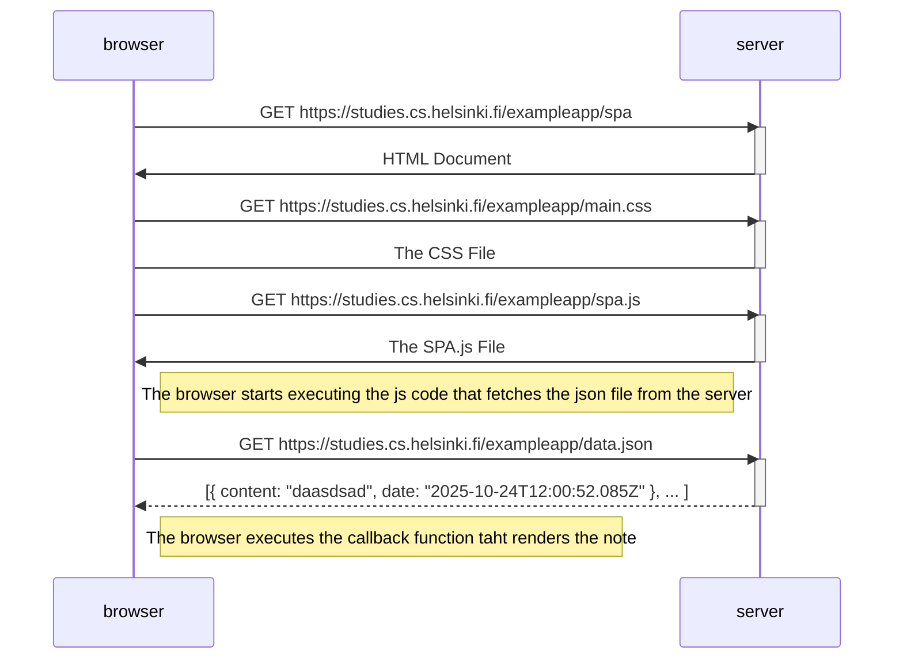

```mermaid
sequenceDiagram
    participant browser
    participant server

    browser->>server: GET https://studies.cs.helsinki.fi/exampleapp/spa
    activate server
    server->>browser: HTML Document
    deactivate server

    browser->>server: GET https://studies.cs.helsinki.fi/exampleapp/main.css
    activate server
    server->browser: The CSS File
    deactivate server


    browser->>server: GET https://studies.cs.helsinki.fi/exampleapp/spa.js
    activate server
    server->>browser: The SPA.js File
    deactivate server

    Note right of browser: The browser starts executing the js code that fetches the json file from the server

    browser->>server: GET     https://studies.cs.helsinki.fi/exampleapp/data.json
    activate server
    server-->>browser: [{ content: "daasdsad", date: "2025-10-24T12:00:52.085Z" }, ... ]
    deactivate server

    Note right of browser: The browser executes the callback function taht renders the note
```