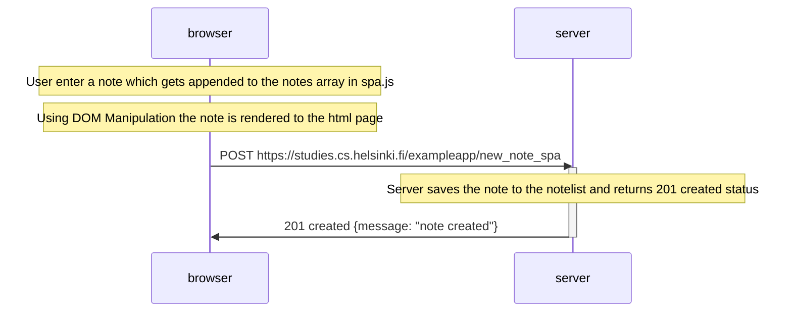

```mermaid
sequenceDiagram
    participant browser
    participant server

    Note over browser: User enter a note which gets appended to the notes array in spa.js
    Note over browser: Using DOM Manipulation the note is rendered to the html page

    browser->>server: POST https://studies.cs.helsinki.fi/exampleapp/new_note_spa
    activate server
    Note over server: Server saves the note to the notelist and returns 201 created status
    server->>browser: 201 created {message: "note created"}
    deactivate server
    
```