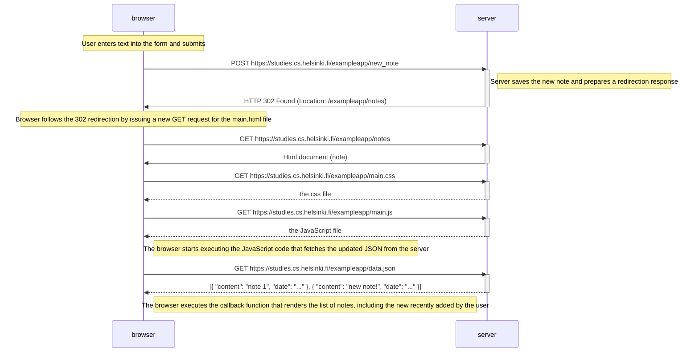

```mermaid
sequenceDiagram
    participant browser
    participant server

    Note over browser: User enters text into the form and submits

    browser->>server: POST https://studies.cs.helsinki.fi/exampleapp/new_note
    activate server
    Note right of server: Server saves the new note and prepares a redirection response
    
    server->>browser: HTTP 302 Found (Location: /exampleapp/notes)
    deactivate server

    Note over browser: Browser follows the 302 redirection by issuing a new GET request for the main.html file

    browser->>server: GET https://studies.cs.helsinki.fi/exampleapp/notes
    activate server
    server->>browser: Html document (note)
    deactivate server

    browser->>server: GET https://studies.cs.helsinki.fi/exampleapp/main.css
    activate server
    server-->>browser: the css file
    deactivate server

    browser->>server: GET https://studies.cs.helsinki.fi/exampleapp/main.js
    activate server
    server-->>browser: the JavaScript file
    deactivate server

    Note right of browser: The browser starts executing the JavaScript code that fetches the updated JSON from the server

    browser->>server: GET https://studies.cs.helsinki.fi/exampleapp/data.json
    activate server
    server-->>browser: [{ "content": "note 1", "date": "..." }, { "content": "new note!", "date": "..." }]
    deactivate server

    Note right of browser: The browser executes the callback function that renders the list of notes, including the new recently added by the user    

```